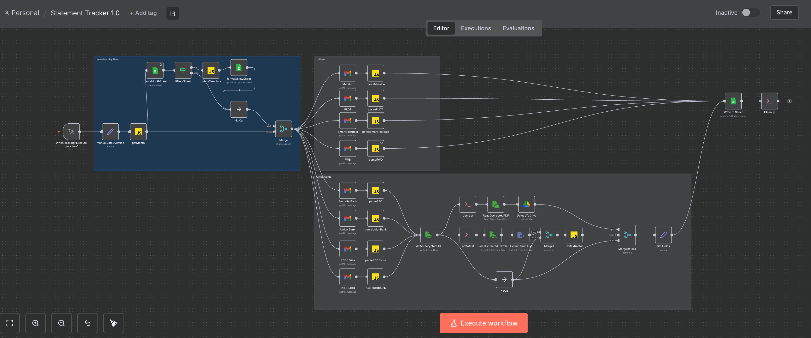
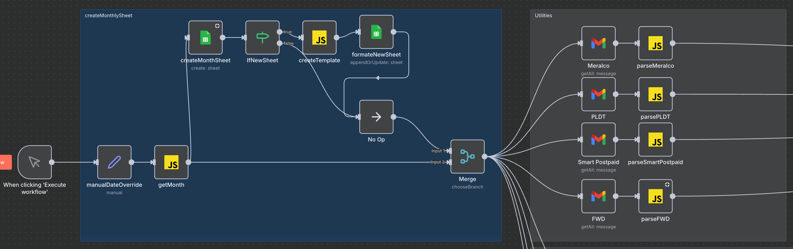
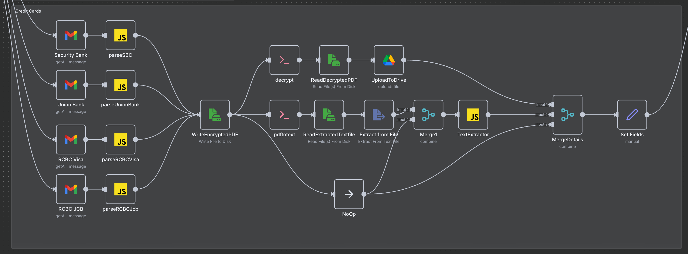
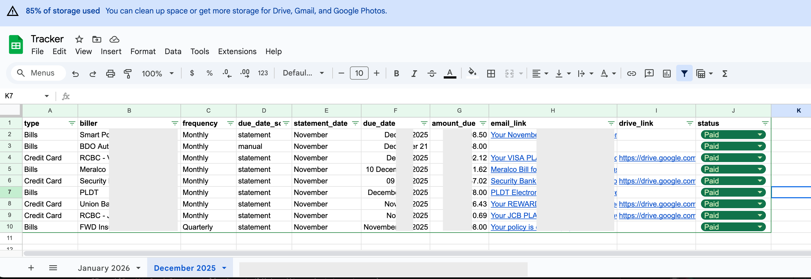
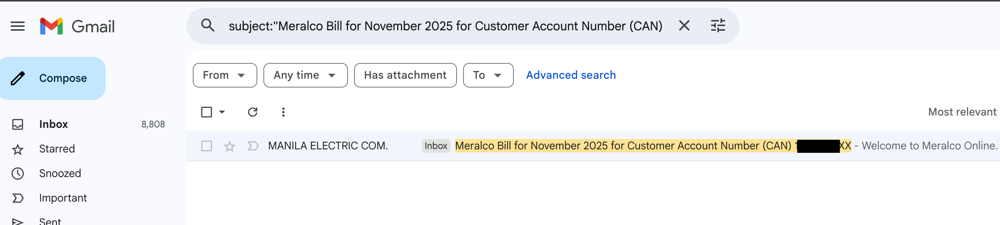
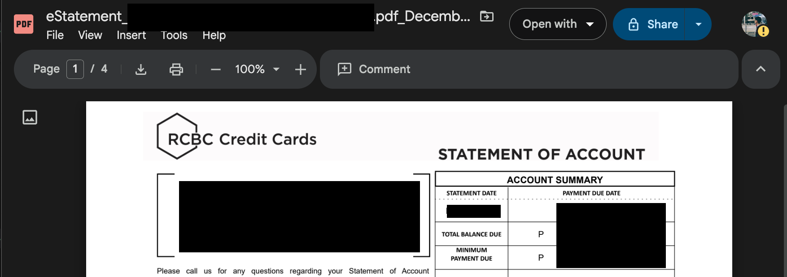
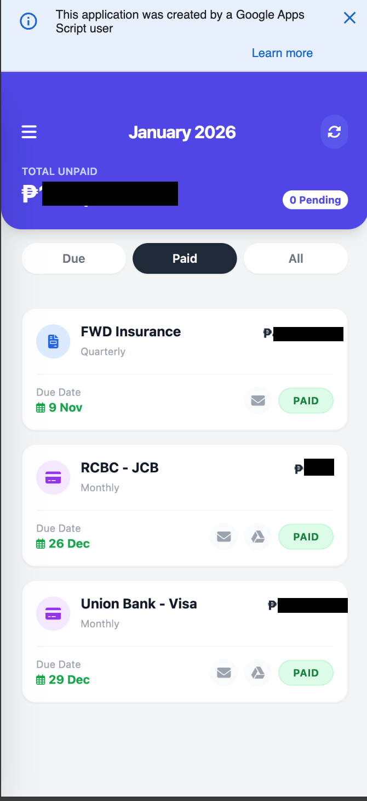

---

layout: post
title: "Building an Automatic Monthly Statement Tracker with n8n"
description: "How I automated my monthly bill and credit card statement tracking using localhost n8n, Gmail, Google Drive, and Google Sheets."
date: 2026-01-03
categories: [automation, n8n, personal-finance]
tags: [n8n, automation, gmail, google-sheets, pdf]
---

## Building an Automatic Monthly Bills and Credit Card Statement Tracker with n8n 

Tracking monthly bills sounds simple until you actually do it consistently.

Some providers send plain emails with no attachments. Banks send password-protected PDFs. Other payments send no reminders at all. Over time, statements end up scattered across Gmail, downloads folders, and mental notes. Important due dates are easy to miss.

This article documents how I built an **automatic monthly statement tracker using n8n** that consolidates all of this into a single Google Sheet with minimal manual effort whilst maintaing all personal data secured in my local device. 

---

## Objective

The goal was to build a system that:

* Runs automatically every month
* Stores and runs locally on a secure device
* Supports multiple statement formats
* Centralizes all billing data in one place
* Provides fast access to original emails and files

The result is an n8n workflow that functions as a personal finance ingestion pipeline.

---

## Statement Types Supported

The workflow processes three distinct categories of monthly statements:

### 1. Email Based Utility Bills

Some billers provide all relevant information directly in the email body and do not include attachments.

Common examples include:

* Electricity providers
* Internet service providers
* Mobile postpaid plans
* Insurance reminders

### How these are handled

* Gmail is searched using a controlled combination of sender, subject, and date range
* The email body is parsed to extract:

  * Due date
  * Amount due
* A Gmail link is generated that opens the original message directly
* The data is formatted to match other statement types

This avoids unnecessary downloads while preserving traceability to the original source.

---

## 2. Credit Card Statements with PDF Attachments

Credit card statements are typically delivered as PDF attachments and often include additional challenges such as encryption or inconsistent naming.

### How these are handled

* The workflow identifies the correct statement email for the target month
* PDF attachments are downloaded and filtered
* Encrypted PDFs are unlocked automatically
* Text is extracted from the statement
* Key fields are parsed, including:

  * Statement month
  * Due date
  * Total amount due
* The final PDF is uploaded to Google Drive
* Both the Drive file link and Gmail email link are stored

---

## 3. Fixed Statements Without Email Notifications

Some recurring payments do not generate emails but still need to be tracked consistently.

Examples include:

* Car loans
* Personal loans
* Other fixed monthly obligations

### How these are handled

* Predefined amounts and due dates entries are inserted automatically each month

---

## Monthly Sheet Management

Each workflow execution targets a specific month.

* A Google Sheet is created or reused using a `Month Year` naming convention
* If the sheet does not exist, a structured template is inserted
* If it already exists, rows are updated instead of duplicated

This keeps monthly records clean and easy to review.

---

## Unified Data Structure

All statements, regardless of source, are normalized into a single structure:

* Statement type
* Biller name
* Billing frequency
* Statement month
* Due date
* Amount due
* Gmail link
* Google Drive link
* Status field

---

## Gmail / Google Drive Direct Links

Instead of storing plain references, the workflow generates clickable Gmail links using Google Sheets formulas.

Selecting a link opens Gmail with the relevant email already filtered. This removes the need to manually search through inbox history.

 While selecting the drive link will automatically open the decrptyed attachment e.g.(Credit Card Statement) in google drive preview mode.

---

## Bonus! Lightweight Web App for Daily Use.

While the Google Sheet acts as the system of record, interacting with it directly on mobile is not always convenient.

To address this, I also built a **Google Apps Script web app** (using vanilla html, css, js) that is directly linked to the same spreadsheet.

### Purpose of the web app

The web app is designed for quick, day to day interaction. It provides:

* A simplified mobile friendly UI
* A monthly view of all statements
* Clear visibility into total unpaid amounts
* A count of pending items
* Quick access to due dates
* The ability to mark bills as paid without opening the sheet

This removes the need to scroll, filter, or edit rows manually on my phone.

{: w="250" h="150" }
